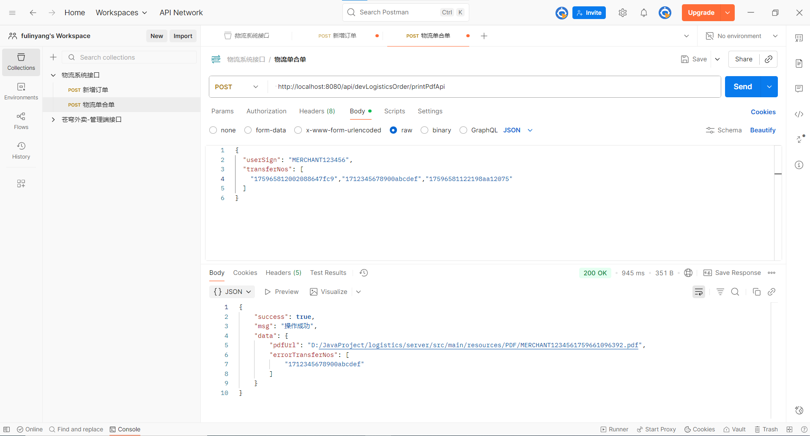

# 项目开发日志
## 第一天
实现了项目初始化环境的搭建，使用了3.5.6版本的springboot框架
## 第二天
实现了接口一的接收订单数据并返回的功能
## 第三天
进一步完善了接口一，实现了生成pdf文件的功能

## 第四天
优化了pdf文件的排版，修复了物流订单号校验的bug
## 第五天
修复了包裹信息校验和商品信息校验的bug，实现了根据多个物流单号，合单打印物流单基本信息pdf的功能，至此，后端所要求的接口均已完成。

